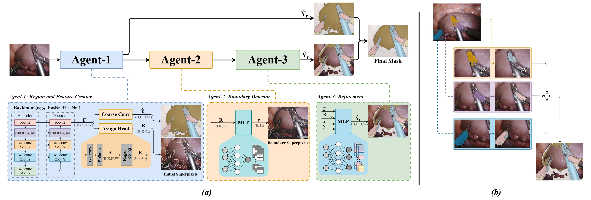

# BRDG: Boundary-Responsive Differentiable Gating for Superpixel-Based Segmentation

Official repository for:

**Boundary-Responsive Differentiable Gating for Superpixel-Based Segmentation**
*CVPR 2026*

Fatmaelzahraa Ali Ahmed¹ · Zhihe Lu² · Gianni Di Caro³ · Diram Tabaa³ · Mohamed Hamdy⁴ ·
Muraam Abdel-Ghani¹ · Abdulaziz Al-Ali⁴ · Muhammad Arsalan⁵ · Shidin Balakrishnan¹*

¹ Hamad Medical Corporation · ² Hamad Bin Khalifa University ·
³ Carnegie Mellon University Qatar · ⁴ Qatar University · ⁵ KINDI Center, Qatar University
<br>\* Corresponding author

---

## 🔗 Resources

| Resource | Link |
|---|---|
| Project Page | https://fatma936-sudo.github.io/BRDG/ |
| Pretrained Weights | [Releases v0.1](https://github.com/fatma936-sudo/BRDG/releases/tag/v0.1) |
| Poster | [CVPR 2026 poster](https://cvpr.thecvf.com/media/PosterPDFs/CVPR%202026/36246.png) |
| YouTube Video | https://youtu.be/CnQG5H667N4 |
| Paper | Coming soon |
| Medium Tutorial | Coming soon |

---

## 🧠 Method

Superpixel-based segmentation is efficient but blurs boundaries; pixel-wise
segmentation is precise but expensive. BRDG resolves the trade-off with three
cooperative agents inside one fully differentiable network.

<p align="center">
  <a href="docs/assets/BRDG_Arch.pdf">
    
  </a>
</p>

| Agent | Role | Implementation |
|---|---|---|
| **1. Region & Feature Creator** | Turns dense features into learnable superpixel tokens | `assign_head`, `coarse_head`, soft pooling |
| **2. Boundary Detector** | Estimates boundary confidence per region → dense gate `g` | `boundary_mlp` |
| **3. Refinement** | Classifies regions and blends the two pathways | `region_cls_mlp` + gated blend |

The output is a convex blend of a dense pathway and a region pathway:

```
Ŷ = (1 − g) · Ŷ_c  +  g · Ŷ_r
```

An **adjacency-boosted contrastive loss** sharpens boundaries by mining hard
negatives across neighbouring regions, weighting adjacent negative pairs by
`w_ik = 1 + α · 1[i, k adjacent]`.

---

## 📊 Results

Cross-method benchmark across four surgical tasks (mIoU).

| Method | E18-Parts | E18-Tools | E17 | Cholec8K | Params (M) | FPS |
|---|---:|---:|---:|---:|---:|---:|
| DeepLabv3+ (R101) | 0.56 | 0.78 | 0.67 | 0.56 | 61.0 | 15.1 |
| U-Net (R34) | 0.53 | 0.64 | 0.42 | 0.43 | 13.4 | 46.0 |
| SegFormer-B5 | 0.57 | 0.71 | 0.63 | 0.74 | 84.7 | 13.8 |
| SwinUNet | 0.65 | 0.59 | 0.64 | 0.68 | 41.0 | 150.6 |
| nnFormer | 0.60 | 0.63 | 0.62 | 0.62 | 53.0 | 123.5 |
| SSN (superpixel) | 0.37 | 0.41 | 0.33 | 0.42 | 0.66 | 271.6 |
| HERS (superpixel) | 0.45 | 0.70 | 0.51 | 0.58 | 7.70 | 564.8 |
| **BRDG (Ours)** | **0.72** | **0.75** | **0.76** | **0.73** | **23.9** | **150.3** |

**Backbone ablation** (EndoVis-2018) — the heads sit on any stride-pyramid encoder:

| Backbone | mIoU | Params |
|---|---:|---:|
| ResNet-34 | 0.72 | 23.9 M |
| ResNet-50 | 0.73 | 37 M |
| ResNet-101 | 0.73 | 56 M |
| ViT | **0.75** | 99 M |

**Component ablation** (EndoVis2018-Parts):

| Variant | mIoU | Inference (ms) | Peak memory (GB) |
|---|---:|---:|---:|
| **Full model** | **0.72** | **6.63** | **1.05** |
| No superpixels | 0.57 | — | > +0.40 |
| No boundary head | 0.57 | — | — |
| No refinement | 0.61 | 6.63 | 1.17 |
| Gate = 0 | 0.61 | — | — |

Beyond surgery: **0.54** mIoU on Cityscapes and **0.60** on ADE20K under the
efficient/foveated protocol. The superpixel-count study on BSDS500 gives an
optimum at `K = 500` (Boundary Recall 0.67).

---

## 📁 Repository layout

```
brdg/
  config.py            dataset class definitions, shared constants
  utils.py             seeding, parameter counting, device
  models/
    backbone.py        ResNet-34/50/101 encoder + UNet decoder -> feature map F
    brdg.py            the three agents and the gated blend
  data/
    endovis.py         EndoVis 2017 / 2018
    benchmarks.py      Cityscapes, ADE20K, BSDS500
    factory.py         build_datasets(...)
  losses/
    segmentation.py    0.5 CE + 0.5 Tversky
    regions.py         per-region boundary and class labels
    contrastive.py     supervised + adjacency-boosted boundary contrastive
  metrics.py           mIoU, Dice, Boundary-F1, latency / FPS / memory
  schedules.py         warmup -> ramp -> full, and the tau anneal
  engine.py            train / validate / evaluate loops
train.py               training entry point
tools/
  visualize_components.py   per-component panels on one frame
  visualize_layers.py       activations at every encoder/decoder stage
docs/                  the project page
```

---

##  Installation

```bash
git clone https://github.com/fatma936-sudo/BRDG.git
cd BRDG

conda create -n brdg python=3.10 -y
conda activate brdg
pip install -r requirements.txt
```

---

##  Training

Defaults follow the paper: ResNet-34, `K = 100`, 512 × 640, AdamW at 1e-4 with
weight decay 1e-4 and a 0.1× encoder rate, 100 epochs on a warmup → ramp → full
schedule.

```bash
python train.py \
  --dataset endovis2018 \
  --data_root /path/to/endovis2018_tools \
  --save_root runs/endovis2018
```

Reproduce the backbone ablation:

```bash
for bb in resnet34 resnet50 resnet101; do
  python train.py --dataset endovis2018 --data_root /path/to/data \
                  --backbone $bb --save_root runs/$bb
done
```

Sweep the adjacency boost (`--adj_boost 1.0` disables it, i.e. α = 0):

```bash
for a in 1.0 1.5 2.0 3.0; do
  python train.py --dataset endovis2018 --data_root /path/to/data \
                  --adj_boost $a --save_root runs/adj_$a
done
```

Expected data layout:

```
endovis2018_tools/{train,val}/left_frames/*.png   +  labels/*.png   # indexed masks
endovis2017/{train,val}/image/*.bmp               +  label/*.bmp
Cityscapes/{leftImg8bit,gtFine}/{train,val}/...                     # labelTrainIds
ADEChallengeData2016/{images,annotations}/{training,validation}/...
BSDS500/data/{images,groundTruth}/{train,val}/...
```

---

##  Inference and visualisation

```python
import torch
from brdg import DifferentiableSuperpixelNet, ResNetUNetBackbone

backbone = ResNetUNetBackbone(arch="resnet101", feat_ch=96, pretrained=False)
model = DifferentiableSuperpixelNet(num_classes=8, num_superpixels=100,
                                    feat_ch=96, tau=0.5, backbone=backbone)
model.load_state_dict(torch.load("brdg_endovis2018_adj3.0.pth")["model"])
model.eval()

out = model(images)               # (B, 3, 512, 640), ImageNet-normalised
pred = out["final_logits"].argmax(1)
```

The forward pass returns every intermediate tensor — `coarse_logits`,
`refined_logits`, `gate`, `assignment_map_spatial`, `region_feats` — which is what
the two interactive figures on the project page are built from:

```bash
python -m tools.visualize_components --ckpt runs/.../best_model.pth \
    --dataset endovis2018 --data_root /path/to/data --index 230 --outdir out/

python -m tools.visualize_layers --ckpt runs/.../best_model.pth \
    --dataset endovis2018 --data_root /path/to/data --index 230 --outdir out/
```

---

##  Pretrained weights

[Releases v0.1](https://github.com/fatma936-sudo/BRDG/releases/tag/v0.1) — ResNet-101
checkpoints (`K = 100`, 512 × 640).

| Checkpoint | Dataset | Classes |
|---|---|---:|
| `brdg_endovis2018_adj3.0.pth` | EndoVis 2018 (tools) | 8 |
| `brdg_endovis2017_adj2.0.pth` | EndoVis 2017 | 8 |
| `brdg_cityscapes_adj3.0.pth` | Cityscapes | 19 |
| `brdg_bsds500_adj1.5.pth` | BSDS500 | 2 |

---

## A note on metrics

`brdg/metrics.py` provides two mIoU/Dice conventions. `miou_score` / `dice_score`
average per image over all classes and are the default used throughout, matching
the published results. `update_confusion` / `metrics_from_confusion` accumulate a
dataset-level confusion matrix and average only over classes with non-zero
ground-truth support; pass `--dataset-level-metrics` to report both. The two
differ whenever a class is absent from an individual image, so state which
convention you used when reporting numbers.

---

## Citation

```bibtex
@inproceedings{aliahmed2026brdg,
  title     = {Boundary-Responsive Differentiable Gating for Superpixel-Based Segmentation},
  author    = {Ali Ahmed, Fatmaelzahraa and Lu, Zhihe and Di Caro, Gianni and
               Tabaa, Diram and Hamdy, Mohamed and Abdel-Ghani, Muraam and
               Al-Ali, Abdulaziz and Arsalan, Muhammad and Balakrishnan, Shidin},
  booktitle = {Proceedings of the IEEE/CVF Conference on Computer Vision and Pattern Recognition (CVPR)},
  year      = {2026}
}
```

---

## Acknowledgement

Supported by Qatar Research Development and Innovation Council (QRDI) grant
ARG01-0522-230266.

## License

See [LICENSE](LICENSE).
